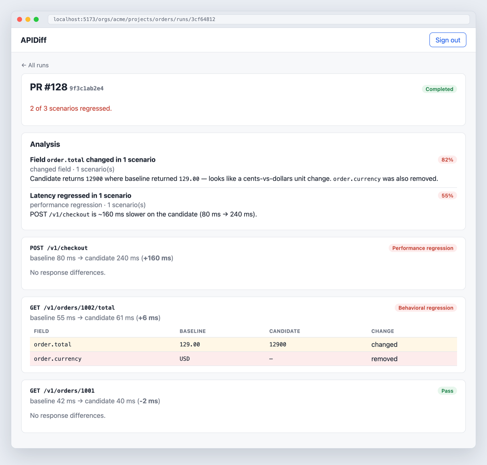
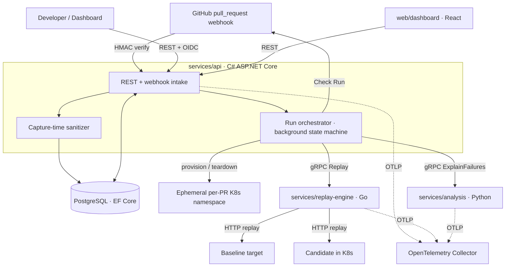
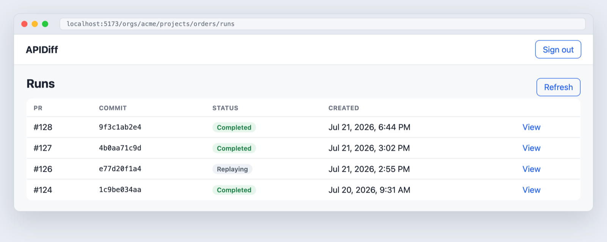
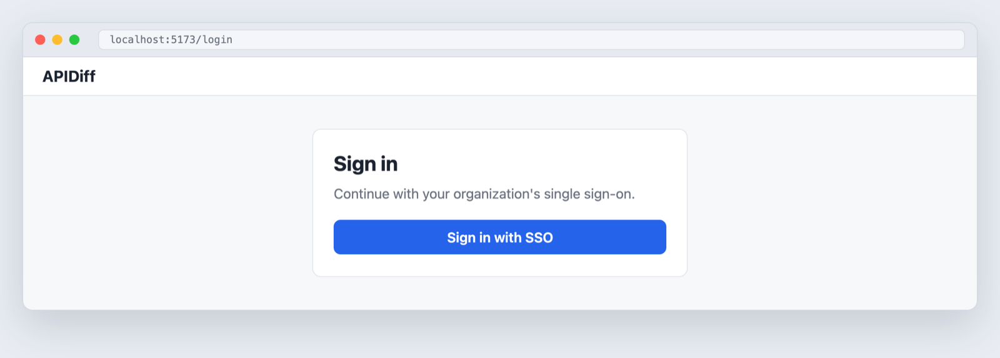

<div align="center">

# APIDiff

**Catch API regressions before you merge.**

APIDiff replays sanitized staging traffic against a pull-request build of your
API, diffs the responses and latency against a baseline, and reports behavioral
and performance regressions as a GitHub check — with a ranked, explained
shortlist of what changed.


</div>

<p align="center">
  
</p>
<p align="center"><sub>Run detail: verdicts, latency deltas, a field-level response diff, and a ranked analysis shortlist.</sub></p>

---

## The problem

Refactoring an existing API is risky: a change can silently alter a response
shape or value, or make an endpoint slower, and unit tests rarely catch it
because they assert what the author *expects*, not what real callers *receive*.

APIDiff catches these regressions **before merge**. It captures real (sanitized)
requests once, then — on every pull request — replays them against the PR build
and a baseline, compares the two, and posts a pass/fail check. Reviewers see
exactly which fields changed and which endpoints got slower.

## How it works



1. **Capture & sanitize** — Staging requests are ingested and scrubbed of
   PII/secrets *at the edge* (header allowlist, JSON/form/text scrubbing, value
   patterns), then stored as reusable scenarios. Tests assert no secret ever
   reaches the database.
2. **Trigger** — A GitHub `pull_request` webhook is HMAC-verified and idempotent;
   it creates a run and enqueues it.
3. **Orchestrate** — A background state machine provisions an ephemeral per-PR
   Kubernetes environment, calls the Go replay engine, persists results, calls
   the Python analysis service, posts a GitHub check, and tears the environment
   down.
4. **Replay & diff** — The Go engine replays each scenario against baseline and
   candidate concurrently, produces a structural + value JSON diff and latency
   delta, and assigns a verdict (`error` > `behavioral` > `perf` > `pass`).
5. **Analyze** — The Python service clusters near-duplicate failures and ranks
   them into an explained shortlist.
6. **Review** — The dashboard renders diffs, latency, and the shortlist.

## Screenshots

| Runs list | Sign in (OIDC SSO) |
|---|---|
|  |  |

## Architecture at a glance

A **monorepo** with a `proto/` gRPC contract as the source of truth. Four
services communicate over gRPC/REST; the C# API owns PostgreSQL as the single
system of record.

| Service | Language | Responsibility |
|---|---|---|
| **`services/api`** | C# / ASP.NET Core (net9) | Auth (OIDC/JWT + RBAC), audit log, capture + sanitization, GitHub webhooks, run orchestration, GitHub App checks, K8s provisioning, REST + OpenAPI |
| **`services/replay-engine`** | Go 1.25 | gRPC `ReplayService`: concurrent worker pool, structural+value JSON diff engine, verdicts, mTLS-capable server |
| **`services/analysis`** | Python 3.13 | gRPC `AnalysisService`: near-duplicate clustering, ranked failure explanations |
| **`web/dashboard`** | React 19 + TypeScript | Runs list, run detail, diff viewer, analysis view, OIDC Authorization-Code + PKCE login |
| **`infra/terraform`** | Terraform | GKE, Cloud SQL (private IP), Artifact Registry, Secret Manager, IAM / Workload Identity |
| **`infra/deploy/apidiff`** | Helm | One chart for base services **and** ephemeral per-PR environments |

## Key features

- **Contract-first gRPC** across C#, Go, and Python — one protobuf contract,
  stubs generated by `buf` (Go/Python) and `Grpc.Tools` (C#), drift-checked in CI.
- **Capture-time PII/secret redaction** — header allowlist + recursive JSON /
  form / text scrubbing + patterns for emails, JWTs, bearer tokens, credit cards,
  SSNs, and cloud keys. Golden **and** integration tests prove secrets never hit
  the DB.
- **Concurrent replay engine (Go)** — bounded worker pool with backpressure and
  per-request timeouts; a 200-scenario test asserts **zero goroutine leaks** under
  the race detector.
- **Structural + value diffing** with ignore-rules for volatile fields, and a
  deterministic verdict precedence.
- **Idempotent GitHub webhooks** (HMAC-SHA256, constant-time) and **GitHub App
  Check Runs** (RS256 app JWT → installation token).
- **Ephemeral per-PR Kubernetes environments**, provisioned and torn down from
  the API via the Kubernetes API.
- **Heuristic failure analysis** — clusters duplicates by normalized request
  path and collapses them into a ranked, explained shortlist.
- **OIDC single sign-on** (Authorization Code + PKCE) in the dashboard, verified
  against the RFC 7636 test vector.
- **Observability** — OpenTelemetry tracing across all three backends, correlated
  by `run_id`; mTLS-capable service-to-service gRPC.
- **Infrastructure as code** — Terraform (validated in CI) + a Helm chart, with a
  Workload-Identity deploy that runs `helm upgrade --wait` and rolls back on a
  failed health gate.

## Tech stack

**Languages** C# (net9) · Go 1.25 · Python 3.13 · TypeScript
**Frameworks / libs** ASP.NET Core · EF Core + Npgsql · gRPC · React 19 · Vite
**Data** PostgreSQL 16 (EF Core migrations)
**Contracts** Protocol Buffers · buf · Grpc.Tools
**Infra / cloud** Terraform (GCP: GKE, Cloud SQL, Artifact Registry, Secret
Manager, Workload Identity) · Helm · Docker · docker-compose · KubernetesClient
**Observability** OpenTelemetry · OTLP · OpenTelemetry Collector
**CI/CD & security** GitHub Actions · Trivy · golangci-lint · ruff/mypy · ESLint
**Testing** xUnit + Testcontainers · `go test -race` + bufconn · pytest · Vitest

## Monorepo layout

```
proto/                 # gRPC contracts — source of truth for service boundaries
services/
  api/                 # C# / ASP.NET Core — auth, orchestration, webhooks, REST
  replay-engine/       # Go — concurrent replay + diff engine
  analysis/            # Python — clustering + failure explanation
web/dashboard/         # React + TypeScript — review UI
infra/
  terraform/           # GCP provisioning
  deploy/              # Helm chart (base + ephemeral per-PR env)
  otel/                # OpenTelemetry Collector config
.github/workflows/     # ci · infra · security · deploy
docs/adr/              # 12 Architecture Decision Records
```

## Run it locally (no GCP, no identity provider)

Prerequisites: **Docker**, and **Node 22+** for the dashboard.

**1. Backend** — Postgres + the four services + an OTel collector:

```bash
docker compose up --build
```

In compose the API runs in **dev-auth mode** (`Authentication:DevMode=true`): it
trusts the bearer token as the signed-in user, so no OIDC provider is needed.
This is off by default and never enabled in production.

**2. Dashboard:**

```bash
cd web/dashboard && npm install && npm run dev   # http://localhost:5173
```

Sign in by pasting any word as the token (e.g. `demo-user`).

**3. Seed a sample run** so there's something to review:

```bash
scripts/seed-demo.sh
```

Then open **Acme Corp → Orders API → PR #128** to see the run in the screenshot
above.

> Production auth uses OIDC single sign-on: set `Authentication:Authority` (API)
> and `VITE_OIDC_AUTHORITY` / `VITE_OIDC_CLIENT_ID` (dashboard).

## Testing & CI/CD

- **Tests** run in all four stacks: C# (xUnit + **Testcontainers** against real
  Postgres), Go (`go test -race`, including a **bufconn** gRPC round-trip and the
  200-scenario no-leak load test), Python (pytest), and the dashboard (Vitest).
- **CI** (`.github/workflows/ci.yml`) is path-filtered — only the jobs for
  changed services run — behind a single aggregate required check.
- **Security** (`security.yml`) runs **Trivy** (committed secrets fail the build;
  dependency + IaC misconfigs are reported). The C# build also treats NuGet
  vulnerability audits as errors.
- **Infra** (`infra.yml`) runs `terraform fmt/validate` and `helm lint`.
- **Deploy** (`deploy.yml`) authenticates with **Workload Identity Federation**,
  builds/pushes images, and runs `helm upgrade --wait` with automatic rollback —
  gated by a `DEPLOY_ENABLED` variable so `main` stays green until a project is
  wired up.

## Project status

APIDiff is **code-complete and fully runnable locally** (`docker compose up` +
the seed script). Every service, the infrastructure-as-code, and the CI/CD
pipeline are implemented and tested. Cloud deployment is **defined but not
enabled** — the deploy workflow is gated on real GCP credentials and has not been
run against a live cluster. There are no production users, uptime, or throughput
numbers, and the reported figures (e.g. the 200-scenario concurrency test) are
from local test runs.

## Documentation

- [`docs/adr/`](docs/adr/) — 12 Architecture Decision Records (the "why").
- [`docs/OBSERVABILITY.md`](docs/OBSERVABILITY.md) — telemetry, SLOs, alerting.
- [`docs/THREAT_MODEL.md`](docs/THREAT_MODEL.md) — STRIDE threat model.
- [`docs/RUNBOOK.md`](docs/RUNBOOK.md) — operational runbook.

## Engineering practice

- No direct pushes to `main`; all changes land via CI-gated PR from a feature branch.
- Conventional Commits; one reviewable concern per PR.
- Non-obvious decisions are recorded as ADRs.
- Every change ships with tests; CI (format → lint → test → build → security scan)
  must be green to merge.
